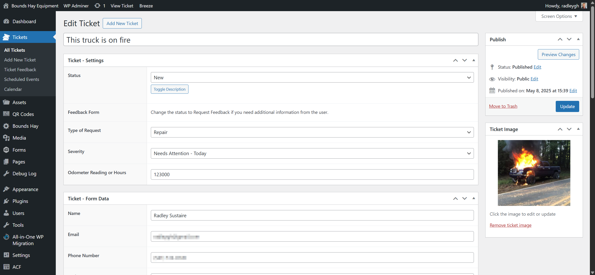

# Bounds Hay Equipment

Provides the Equipment post types and integrations with Gravity Forms and Advanced Custom Fields. QR codes are generated and assigned to each equipment for relaying to contact forms.

## Required Plugins

1. [Gravity Forms](https://www.gravityforms.com/)
2. [Advanced Custom Fields PRO](https://www.advancedcustomfields.com/pro/)

## What's included

- Ticket management
- Asset management (equipment)
- QR Code creation
- Email notifications
- SMS notifications (using Go High Level API)
- Scheduled actions (which create tickets on scheduled days)
- Feedback forms allowing admins to request further feedback

### Ticket Management

## Changelog

### 1.1.3
- Added an option to export tickets to CSV
- Added support for iCal feeds

### 1.1.2
- Moved to Git